<p align="center">
  
</p>

<p align="center">
  <a href="http://sjftechnology.me/SiD_Portfolio/"></a>
  <a href="https://www.linkedin.com/in/sidharth-tv-91b6b3298"></a>
  <a href="https://github.com/Sidsidhuz?tab=followers"></a>
  
</p>

<p align="center">
  <strong>AI/ML Engineer in the making · Python builder · Practical problem solver</strong><br/>
  <sub>📍 Kerala, India &nbsp;·&nbsp; 🟢 Open to entry-level AI/ML opportunities</sub>
</p>

---

## `> whoami`

I’m **Sidharth T V**, an aspiring AI/ML engineer who enjoys turning models and ideas into useful, complete products. My work spans explainable machine learning, computer vision, local AI assistants, MLOps and asynchronous Python backends.

I care about more than model accuracy: I’m learning how to build the data pipelines, APIs, interfaces and deployment workflows that make intelligent systems dependable in the real world.

```python
sidharth = {
    "goal": "Grow into an AI/ML engineer who ships useful systems",
    "building": ["Computer Vision", "Explainable AI", "Local RAG", "MLOps"],
    "learning": ["Production ML", "Cloud Architecture", "Reliable AI APIs"],
    "status": "Open to entry-level roles and meaningful collaborations",
}
```

## 🚀 Featured builds

<table>
  <tr>
    <td width="50%" valign="top">
      <h3 align="center">🌿 <a href="https://github.com/Sidsidhuz/Agro_Link_">AgroLink</a></h3>
      <p>A farm community platform for sharing field knowledge, planning seasons, diagnosing crop symptoms and warning nearby growers.</p>
      <p align="center"><code>FastAPI</code> <code>SQLAlchemy</code> <code>Computer Vision</code> <code>Async Python</code></p>
    </td>
    <td width="50%" valign="top">
      <h3 align="center">🔮 <a href="https://github.com/Sidsidhuz/Enterprise-Data-Intelligence-Platform">AutoInsight</a></h3>
      <p>A fully local, no-code AutoML platform with data profiling, model comparison, SHAP explanations and downloadable reports.</p>
      <p align="center"><code>scikit-learn</code> <code>SHAP</code> <code>FastAPI</code> <code>Streamlit</code></p>
    </td>
  </tr>
  <tr>
    <td width="50%" valign="top">
      <h3 align="center">🧠 <a href="https://github.com/Sidsidhuz/CNN_MLOps">Crop Disease MLOps</a></h3>
      <p>An EfficientNet crop classifier with reproducible training, experiment tracking, API inference and automated container delivery.</p>
      <p align="center"><code>PyTorch</code> <code>DVC</code> <code>MLflow</code> <code>Docker</code></p>
    </td>
    <td width="50%" valign="top">
      <h3 align="center">🤖 <a href="https://github.com/Sidsidhuz/Local_Vector_RAG">Local RAG Assistant</a></h3>
      <p>A privacy-friendly local assistant powered by Ollama, with a browser chat experience, persistent memory and voice output.</p>
      <p align="center"><code>Ollama</code> <code>Python</code> <code>RAG</code> <code>Voice AI</code></p>
    </td>
  </tr>
</table>

<p align="center"><a href="https://github.com/Sidsidhuz?tab=repositories"><strong>Explore all repositories →</strong></a></p>

## 🧰 Engineering toolkit

<p align="center">
  
</p>

<div align="center">

| Area | Technologies |
|:---|:---|
| **AI & Machine Learning** | PyTorch · TensorFlow · scikit-learn · OpenCV · SHAP |
| **Data** | Pandas · NumPy · Matplotlib · EDA · SQL |
| **Backend & Applications** | FastAPI · Django · REST APIs · Async Python |
| **MLOps & Cloud** | MLflow · DVC · Docker · GitHub Actions · AWS · Azure |
| **Foundations** | Python · Java · C · Git · Linux |

</div>

## 📡 Current signal

- 🌱 Deepening my understanding of **production ML systems and cloud-native inference**
- 🧪 Building projects where **models become usable products**, not isolated notebooks
- 🤝 Looking for an **entry-level AI/ML role**, internship or meaningful open-source collaboration
- 💬 Happy to discuss Python, machine learning, computer vision, FastAPI and MLOps

## 📊 GitHub telemetry

<p align="center">
  <picture><source media="(prefers-color-scheme: dark)" srcset="https://github-profile-summary-cards.vercel.app/api/cards/stats?username=Sidsidhuz&amp;theme=github_dark" /></picture>
  <picture><source media="(prefers-color-scheme: dark)" srcset="https://github-profile-summary-cards.vercel.app/api/cards/repos-per-language?username=Sidsidhuz&amp;theme=github_dark" /></picture>
</p>

<p align="center">
  <picture><source media="(prefers-color-scheme: dark)" srcset="https://github-profile-summary-cards.vercel.app/api/cards/profile-details?username=Sidsidhuz&amp;theme=github_dark" /></picture>
</p>

### 🐍 Contributions in motion

<p align="center">
  <picture><source media="(prefers-color-scheme: dark)" srcset="https://raw.githubusercontent.com/Sidsidhuz/Sidsidhuz/output/github-contribution-grid-snake-dark.svg" /></picture>
</p>

## 🤝 Let’s build something useful

I’m currently looking for a place where I can learn from experienced engineers, contribute with energy and turn my AI/ML foundation into production experience.

<p align="center">
  <a href="http://sjftechnology.me/SiD_Portfolio/"></a>
  <a href="https://www.linkedin.com/in/sidharth-tv-91b6b3298"></a>
</p>

<p align="center">
  <br/>
  <em>Learning deeply · Building practically · Growing into AI engineering</em>
</p>
